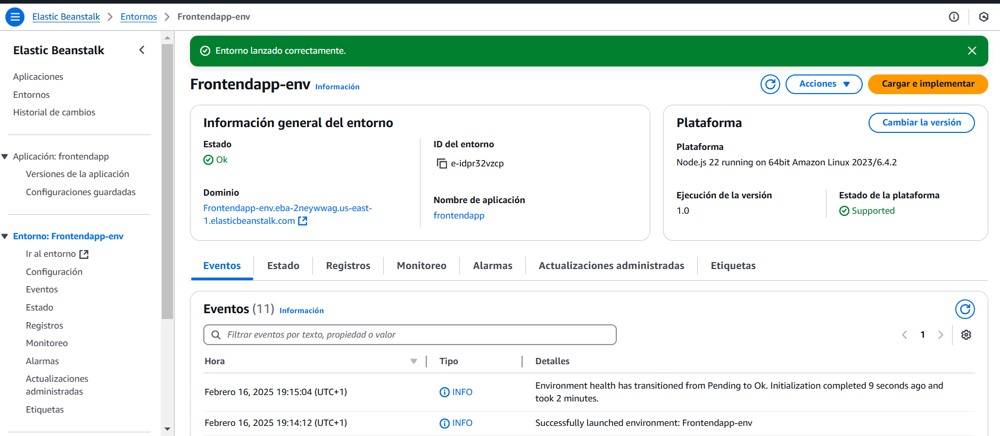
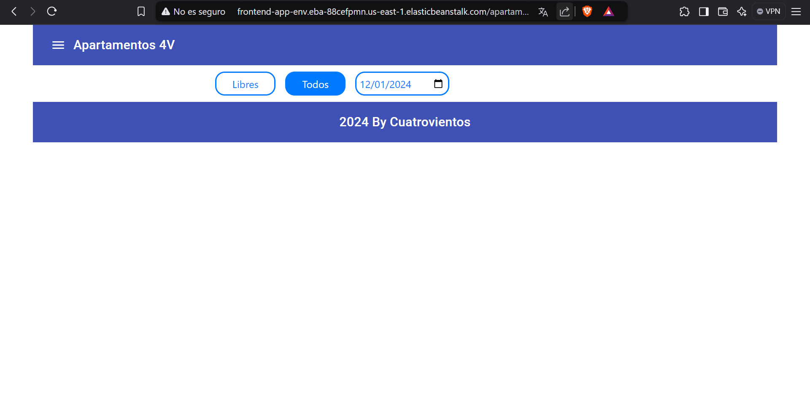
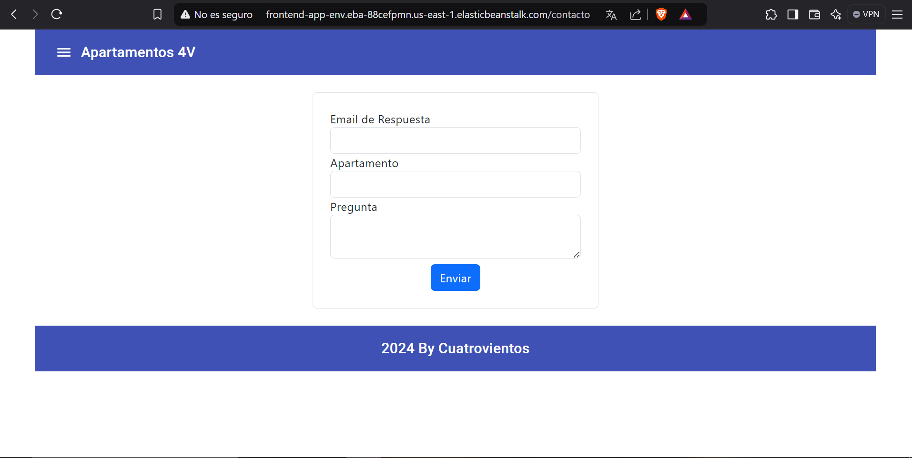
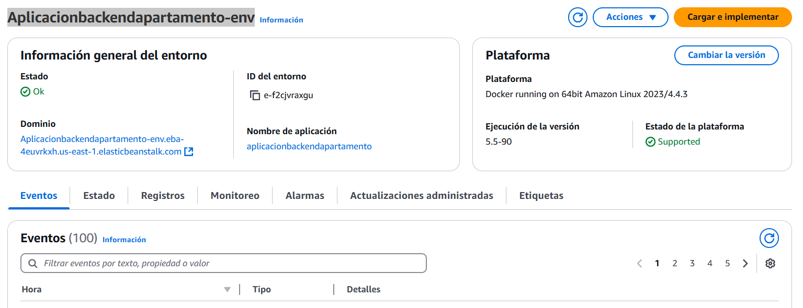
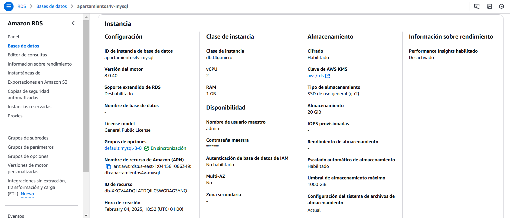
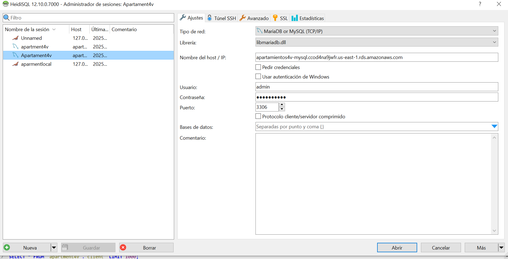

# Manual de Implantación de Arquitectura WEB en AWS

Este manual describe cómo desplegar un entorno web completo en AWS, utilizando Elastic Beanstalk (EBS) para el frontend y el backend, y Amazon RDS o EC2 para la base de datos MariaDB.

---

## **1. Introducción**

La arquitectura incluye tres componentes principales:

1. **Frontend**: Aplicación web estática desarrollada con AngularJS desplegada en AWS Elastic Beanstalk.
2. **Backend**: Aplicación web dinámica desarrollada con Symfony desplegada en AWS Elastic Beanstalk.
3. **Base de Datos**: Implementada usando Amazon RDS para MariaDB o una instancia EC2 configurada manualmente.

---

## **2. Requisitos Previos**

Antes de comenzar, asegúrate de contar con lo siguiente:

1. Una cuenta activa de AWS.
2. Herramientas instaladas:
   - AWS CLI
   - Elastic Beanstalk CLI
   - MySQL Workbench o una herramienta similar (para gestionar la base de datos).
3. Código fuente del frontend y backend (actualizado según los pasos indicados).

---

## **3. Configuración del Entorno en AWS**

### **3.1. Configuración del Frontend en AWS Elastic Beanstalk**

1. Inicia sesión en la consola de AWS.
2. Ve a **Elastic Beanstalk** > **Crear aplicación**.
3. Configura la aplicación:
   - **Nombre de la aplicación**: `Frontend-App`
   - **Plataforma**: `Node.js` (AngularJS funciona bien en este entorno).
4. Carga el archivo ZIP del frontend actualizado.
5. Crea el entorno.



#### Captura requerida:
- Pantalla de configuración de la aplicación frontend en AWS Elastic Beanstalk.




---

### **3.2. Configuración del Backend en AWS Elastic Beanstalk**

1. Ve a **Elastic Beanstalk** > **Crear aplicación**.
2. Configura la aplicación:
   - **Nombre de la aplicación**: `Aplicacionbackendapartamento-env `
   - **Plataforma**: `DOCKER` (compatible con Symfony).
3. Carga el archivo ZIP del backend actualizado.
4. Configura las variables de entorno necesarias:
   - `DATABASE_URL`: Proporciona la URL de la base de datos.
   - `CORS_ALLOW_ORIGIN`: Configura según el dominio del frontend.
5. Crea el entorno.

#### Captura requerida:

---

### **3.3. Configuración de la Base de Datos**

#### **Opcion 1: Amazon RDS para MariaDB**
1. Ve a **Amazon RDS** > **Crear Base de Datos**.
2. Selecciona:
   - **Tipo de motor**: MariaDB
   - **Versión**: La más reciente compatible con tu backend.
3. Configura las credenciales (usuario y contraseña).
4. Configura el acceso público:
   - Habilita el acceso público si es necesario.
   - Configura las reglas de seguridad para permitir el acceso desde el backend.
5. Crea la base de datos.



---

**Conexión a una Base de Datos Amazon RDS desde HeidiSQL**


3.1. Abrir HeidiSQL.

3.2. Crear una nueva conexión.
- En la pantalla principal, hacer clic en **New** (Nueva).
- Configurar los campos:
  - **Network type:** MySQL (TCP/IP).
  - **Hostname/IP:** Endpoint de la base de datos RDS.
  - **Port:** 3306.
  - **User:** Usuario administrador de la base de datos (ejemplo: `admin`).
  - **Password:** Contraseña definida en la creación de la instancia.
  - **Database:** Nombre de la base de datos (ejemplo: `apartment4v`).

3.3. Probar la conexión.
- Hacer clic en **Open** (Abrir).
- Si la conexión es exitosa, se mostrará la base de datos en el panel lateral.
- En caso de error, verificar:
  - Endpoint y puerto.
  - Reglas del Security Group.
  - Usuario y contraseña.

---



**4. Verificar la Base de Datos**

4.1. Ejecutar consultas SQL.
- Navegar a la base de datos.
- Crear una consulta nueva y ejecutar comandos SQL (ejemplo: `SELECT * FROM apartment;`).

4.2. Confirmar la integración.
- Si los datos se muestran correctamente, la conexión está lista.

---


**Conclusión:**

La conexión a una base de datos MariaDB en Amazon RDS desde HeidiSQL permite verificar el estado y los datos antes de integrar la base de datos con el backend de Symfony.

Si la conexión es exitosa, se puede proceder a ajustar la variable `DATABASE_URL` en el entorno del backend.


### **3.4. Modificaciones en los Archivos del Proyecto**

#### **Frontend**
- Modifica `main-ZKT6JCA3.js` reemplazando `http://127.0.0.1:8000` por la URL del backend.

#### **Backend**
- Modifica `.env` configurando:
  - `DATABASE_URL`
  - `CORS_ALLOW_ORIGIN`

#### Capturas requeridas:
- Captura de las modificaciones realizadas en los archivos mencionados.

---

## **4. Verificación del Entorno**

1. **Frontend**: Accede a la URL del frontend desplegado y verifica que carga correctamente.
2. **Backend**: Realiza peticiones al backend para confirmar su conectividad con el frontend y la base de datos.
3. **Base de Datos**: Verifica que los datos se pueden leer y escribir correctamente desde el backend.

#### Capturas requeridas:
- Captura de la aplicación frontend funcionando.
- Captura de la respuesta de una petición al backend.
- Captura del acceso a la base de datos desde el backend.

---

## **5. Entrega del Proyecto**

Sube el siguiente contenido a tu repositorio:

1. Carpeta `AWS-Web-Architecture` organizada así:
   ```
   /AWS-Web-Architecture
       /frontend
           - Código actualizado
       /backend
           - Código actualizado
       /database
           - Script SQL para la base de datos
       README.md
   ```
2. Documentación en el archivo `README.md` con todas las instrucciones y capturas.

# Troubleshooting - Problema con la organización de archivos en Elastic Beanstalk

## Problema detectado:
Al intentar desplegar tu aplicación en Elastic Beanstalk, se presentó un fallo debido a que los archivos esenciales no estaban correctamente organizados dentro del archivo comprimido cargado en el servicio. Elastic Beanstalk no pudo interpretar ni ejecutar correctamente el despliegue de la aplicación.

## Análisis:
Elastic Beanstalk requiere que el paquete comprimido (.zip) que subas contenga una estructura específica, en donde estén incluidos todos los archivos de la aplicación, como también configuraciones necesarias (por ejemplo, `Dockerrun.aws.json` o un `Procfile`, dependiendo de la tecnología utilizada). En el archivo proporcionado inicialmente, faltaba esta organización, lo que impidió que el entorno pudiera ser configurado adecuadamente.

## Solución aplicada:

1. **Revisión de la estructura de los archivos:**  
   Se inspeccionaron los contenidos del archivo comprimido y se identificó que no incluía las configuraciones necesarias en la raíz del proyecto.

2. **Corrección de la estructura:**  
   - Se movieron los archivos principales de la aplicación (como HTML, CSS, o cualquier archivo de configuración) a la raíz del archivo comprimido.  
   - Se verificó que no existieran carpetas innecesarias que añadieran rutas intermedias, ya que Elastic Beanstalk espera acceder directamente a los documentos necesarios desde la raíz.

3. **Verificación del archivo comprimido:**  
   - Se comprimió nuevamente el proyecto en formato `.zip` asegurando que los documentos esenciales estuvieran correctamente organizados y accesibles desde la raíz del archivo.

4. **Nuevo despliegue:**  
   Una vez corregida la estructura, el archivo comprimido fue cargado nuevamente a Elastic Beanstalk, y el despliegue fue exitoso.

## Conclusión:
El error fue causado por una falta de organización en la estructura de los archivos del proyecto. Elastic Beanstalk requiere que el contenido esté preparado y organizado de acuerdo con sus requisitos para interpretar y desplegar correctamente la aplicación. Al corregir este problema, el despliegue se realizó sin inconvenientes.


---
### Troubleshooting: Problemas con Elastic Beanstalk y Aplicaciones Estáticas

---

### Causa del Problema

#### Elastic Beanstalk espera un entorno dinámico (Node.js)
- Elastic Beanstalk, cuando se configura como un entorno **Node.js**, requiere los siguientes archivos para iniciar una aplicación:
  - **`package.json`**: Archivo de configuración que define dependencias y scripts de inicio.
  - **`server.js` o `app.js`**: Archivo que actúa como el punto de entrada del servidor (por ejemplo, utilizando `Express`).

#### Aplicación estática
- Si tu aplicación incluye únicamente archivos estáticos como `index.html`, CSS, e imágenes, Elastic Beanstalk no puede manejar estos archivos directamente en un entorno Node.js sin configuraciones adicionales.

---

### Soluciones

#### 1. Configurar Elastic Beanstalk para Manejar Archivos Estáticos

1. **Crear un servidor simple con Node.js**:
   - Agrega un archivo `server.js` al proyecto con el siguiente contenido:
     ```javascript
     const express = require('express');
     const path = require('path');
     const app = express();

     // Servir archivos estáticos desde el directorio actual
     app.use(express.static(path.join(__dirname)));

     // Manejar rutas desconocidas redirigiendo a index.html
     app.get('*', (req, res) => {
         res.sendFile(path.join(__dirname, 'index.html'));
     });

     // Inicia el servidor en el puerto que Elastic Beanstalk asigna
     const PORT = process.env.PORT || 8080;
     app.listen(PORT, () => {
         console.log(`Servidor corriendo en el puerto ${PORT}`);
     });
     ```

2. **Crear un archivo `package.json`**:
   - Define las dependencias necesarias (como `express`) y el script de inicio:
     ```json
     {
       "name": "static-app",
       "version": "1.0.0",
       "main": "server.js",
       "scripts": {
         "start": "node server.js"
       },
       "dependencies": {
         "express": "^4.18.2"
       }
     }
     ```

3. **Instalar las dependencias**:
   - Ejecuta:
     ```bash
     npm install
     ```

4. **Subir a Elastic Beanstalk**:
   - Comprime tu proyecto incluyendo los archivos `server.js`, `package.json`, `node_modules` y todos los archivos estáticos.

---

#### 2. Usar una Plataforma de Servidor Estático

1. **Cambia la plataforma de Elastic Beanstalk**:
   - Crea un nuevo entorno en Elastic Beanstalk y selecciona una plataforma de **"Static Web Server"** (si está disponible).

2. **Configura AWS S3**:
   - Sube los archivos estáticos (HTML, CSS, JS) a un bucket en **Amazon S3** y configura el bucket para **hosting estático**.
   - Accede a la aplicación desde la URL generada por S3.

---

#### 3. Usar un Hosting Alternativo

- Si Elastic Beanstalk no es adecuado para tu caso, considera usar servicios como:
  - **Amazon S3** con **CloudFront** (distribución global).
  - **Netlify** o **Vercel** para aplicaciones puramente estáticas.

---

### Probar la Configuración

- Asegúrate de que la aplicación funcione localmente antes de subirla.
- Usa herramientas como **Postman** o el navegador para probar la URL del entorno Elastic Beanstalk.

---

### Errores Comunes y Cómo Solucionarlos

| **Error**                                        | **Causa**                                                          | **Solución**                                                                                                                                      |
|--------------------------------------------------|---------------------------------------------------------------------|---------------------------------------------------------------------------------------------------------------------------------------------------|
| `Instance deployment failed to generate a 'Procfile'` | Faltan archivos como `server.js` o `package.json`.                 | Agregar un `Procfile` o los archivos requeridos para definir cómo iniciar la aplicación.                                                         |
| `Application update failed`                     | Configuración incorrecta o falta de dependencias.                  | Verifica que el entorno y los archivos subidos sean consistentes con la plataforma seleccionada.                                                 |
| `None of the instances are sending data`        | Problemas de configuración de red o instancia inactiva.            | Revisa los logs del entorno en Elastic Beanstalk y verifica la salud de las instancias.                                                          |
| `Access-Control-Allow-Origin` bloqueado (CORS) | Dominio del frontend no permitido en el backend.                   | Configura correctamente las reglas de **CORS** en el backend (por ejemplo, agregando el dominio del frontend a las reglas permitidas). |

---


